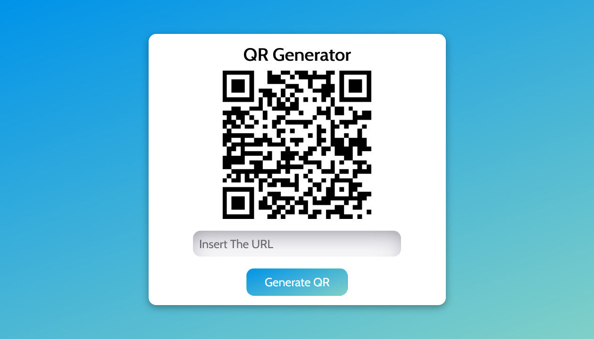
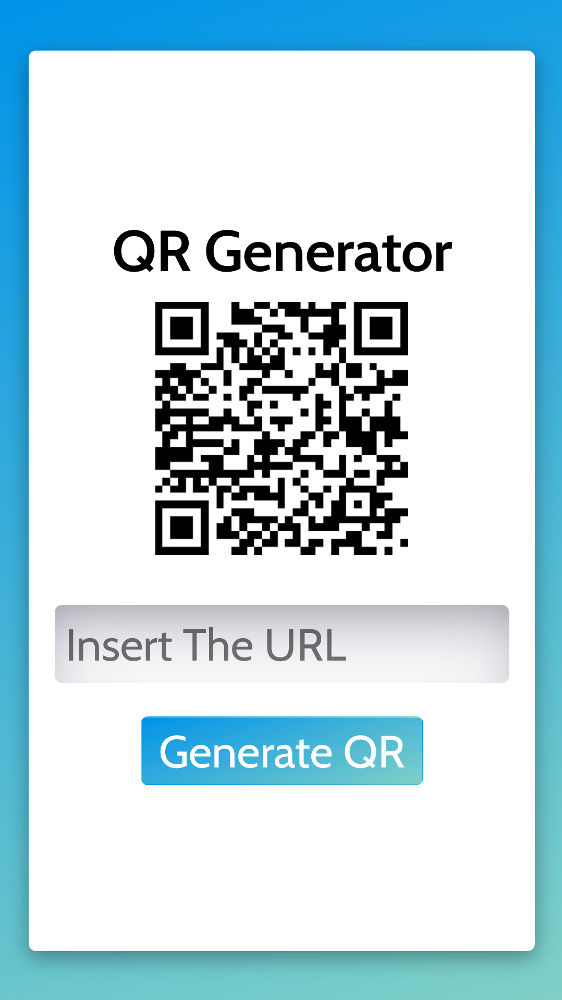

   
   <h1>QR Generator</h1
      
   
Este proyecto fue desarrollado con la librería <b>QRCode.js</b> y fue creado con la finalidad de poder generar códigos QR.

   <a href="https://erikgiovani.github.io/qr-generator/">Ver Sitio</a>

   <h2>Tecnologías</h2>
   
   
HTML5, CSS3, TypeScript y Node JS

   <h2>Escritorio</h2>
   

   <h2>Celular</h2>
   

